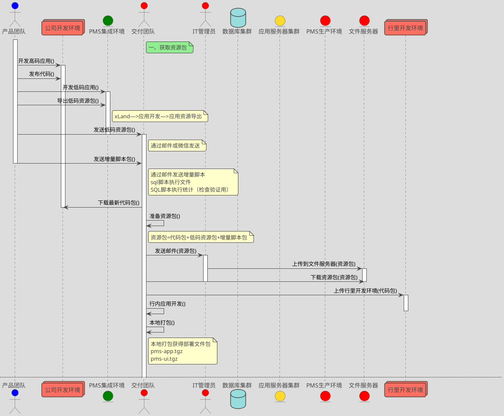

```plantuml
@startuml 华夏pms升级部署上线时序图
!theme toy
skinparam SequenceMessageAlignment right

actor "产品团队" as dev #blue
collections "公司开发环境" as repo
entity "PMS集成环境" as pms #green

actor "交付团队" as set #red
actor "IT管理员" as it #red
database "数据库集群” as data
entity  "应用服务器集群" as server
entity "PMS生产环境" as hxb #red

entity "文件服务器" as ftp #red
collections "行里开发环境" as bank
' entity  "NAS" as nas
' entity "外部系统" as dict

note right of set : 一、获取资源包
activate dev
dev -> repo : 开发高码应用()
activate repo
dev -> repo : 发布代码()

dev -> pms : 开发低码应用()
activate pms

dev-> pms : 导出低码资源包()
note right of pms #Business
xLand—>应用开发—>应用资源导出
end note

dev->set:发送低码资源包()
deactivate pms
note right of set #Business
通过邮件或微信发送
end note

activate set
dev -> set : 发送增量脚本包()
note right of set #Business
通过邮件发送增量脚本
sql脚本执行文件
SQL脚本执行统计（检查验证用）
end note
deactivate dev

set  -> repo : 下载最新代码包()
deactivate repo

set -> set : 准备资源包()
note right of set #Business
资源包=代码包+低码资源包+增量脚本包
end note

set -> it : 发送邮件(资源包)

activate it
it-> ftp:上传到文件服务器(资源包)

activate ftp
set ->ftp :下载资源包(资源包)

deactivate it
deactivate ftp

set -> bank:上传行里开发环境(代码包)
activate bank
set -> set :行内应用开发()
deactivate bank
set -> set :本地打包()
note right of set #Business
本地打包获得部署文件包
pms-app.tgz
pms-ui.tgz
end note
|||
newpage


|||
note right of set : 二、准备数据库环境
set -> data : 删除表()
activate data

note right of data #Business
删除表lib_problem_rectification
...
drop table lib_problem_rectification
解决特殊问题
end note

set -> data: 创建表()

note right of data #Business
行内开发应用相关表：
外部机构相关表
法审对接相关表
...
end note

set -> data : 备份表()

note right of data #Business
备份权限组相关表
备份用户组相关表
如：
备份gf_post表数据到临时表gf_post_temp
备份gf_role表数据到临时表gf_role_emp
...
是为了有问题时回滚
end note

set -> data : 更新表结构()
note right of data #Business
报表相关.sql
字段新增.sql
字段修改.sql
注意：此处缺少相关检查，期望解决
约束：字段修改操作，字段长度只能增加不能减少
（根据产品团队提供的增量脚本）
end note

set -> data : 初始化数据()
note right of data #Business
01报表相关初始化数据.sql
02机构备份初始化还原执行时注意.txt
03权限组相关表新增.sql
04全量机构.txt
05全量用户.txt
06全量机构用户关系.txt
07用户组相关表新增.sql
08资源表gf_res插入语句（需要拿最新数据）.txt
09字典表gf_dict_type插入语句.txt
10外部机构配置表插入语句（需要拿最新数据）.txt
11字典表gf.dict插入语句.txt
12定时任务gf_job插入语句（需要拿最新的）.txt
注意：有识别不准的字典项上敢改，原来是怎样现在也是怎样
类似影像平台的域名，需要维护
end note

set -> set : 维护回滚脚本()
deactivate data

note right of set #Business
维护初始化数据回滚脚本
维护建表回滚脚本
是为了有问题时回滚
end note

set -> set : 检查数据完成状态()
note right of set #Business
检查数据是否完成检查上述内容是否对等
报表上线脚本
定时任务统计
上线sql索引数
上线脚本清单
字段新问题
例如：报表脚本目录：
文件夹、文件、描述、脚本数量
执行脚本、report-20240201-ddl.sql、修改管理人id超长问题、4
回退脚本、report-rolback-20240201-ddl.sql、xxxx、1
有问题及时回滚
end note


newpage
|||
note right of set :三、部署PMS前后端
set -> server: 部署应用包()
note right of server #Business
nginx、后端包、前端包、xDoc
同时部署四台服务器
部署107.17.78.5
部署107.17.78.6
部署107.17.78.7
部署107.17.78.8

部署xDoc:
1.移走之前部署的jar包
2.放置新包
3.安装字体刷新(首次)
4.新建字体安装路径(首次)
5.脚本启动xDoc
end note


activate server
set -> server: 替换配置文件()
note right of server #Business
datav配置文件（4份）
nginx配置文件(4份）
yml配置文件
部署、启动、停止脚本
注意：
1.备份原来的包
2.xDoc单独启动
end note


set -> server: 应用参数配置和检查()
note right of server #Business
检查微信参数(key,appid,url,tokenUrl)
检查application.yml
--->端口是否配置正确
--->定时任务是否开启
--->共享session是否正确
--->拦截sql是否配置正确
检查application-kingwow.yml
--->用户是否正确
--->密码是否正确
--->schame是否正确
--->参数是否和uat一致
外部机构插入子文件的定时任务放开
end note

set -> hxb: 手工导入资源()
deactivate server
activate hxb
note right of hxb #Business
Excel导入模板
Excel导出模板
数据模型里的Word套打模板
低码资源包（）
--->页面管理
--->数据模型
--->流程定义
--->持久化对象
--->表单管理
--->Excel模板
--->系统脚本
--->流程分类
--->流程表单定义

注意：
每次会有增量
低码json太大，通过拆分，分批导入
end note


newpage
|||
note right of set : 四、部署datav
set -> server:部署datav()

note right of server #Business
datav单独部署
配置文件内的ip校验
（.5.6.7.8）
前端绑定IP校验
（.5.6.7.8）
end note

|||
note right of set : 五、配置网络参数
set -> server:配置网络参数

note right of server #Business
记录行里分配的ip地址和域名
记录行里三方系统的ip地址和域名
记录行里三方系统对接的目录和文件发送接收参数
保证系统中配置相匹配
上线前后校验

end note

|||


note right of set : 六、导入业务历史数据

set -> hxb: 导入业务历史数据()

note right of hxb #Business
历史财务数据补偿
--->管理人补充信息
--->管理人全面信息
--->理财系列数据的导入
--->普通项目
--->其他系列
项目数据
--->管理人
--->理财系列模板
--->普通项目
--->其他系列模板
--->问题库
档案类型的修改
生产需要优化的sql脚本

备注：通过接口导入excel或执行sql脚本实现。
期望：咱们提供模板，行方填充模板数据，导入系统
问题：特别长的sql，在dbeaver中卡死，有word文件存在数据表中
end note

newpage
|||

note right of set : 七、上线后校验
set -> hxb : 技术校验()
note right of hxb #Business
创建用户
绑定权限组
绑定资源
登录创建的用户进行访问验证
文件预览校验
检查流程图、低码相关页面和内容是否有乱码
外部系统连接校验
--->telnet IP 端口

end note
set -> hxb : 业务校验()
note right of hxb #Business
项目申请管理
新增项目申请记录
暂存项目申请记录
提交发起项目申请流程
办理项目申请任务

end note

@enduml
```
