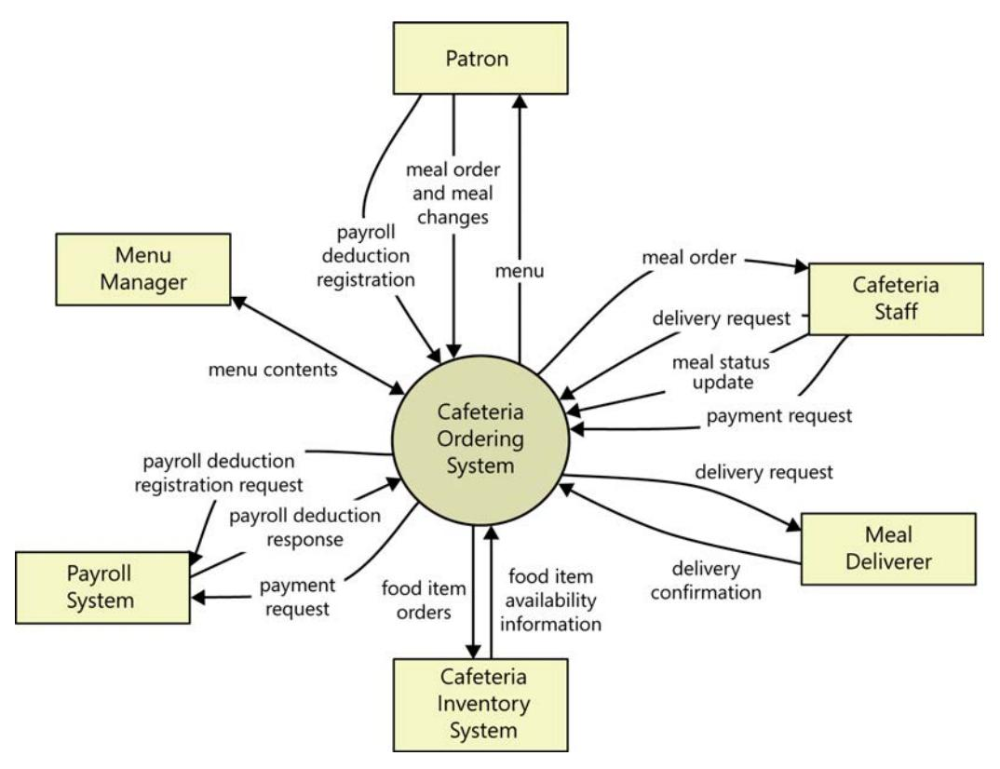
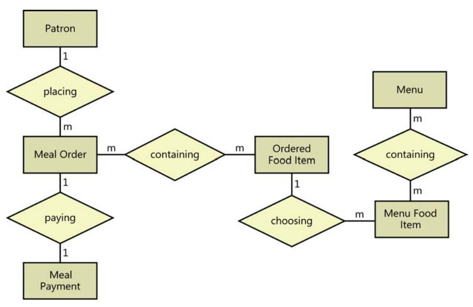

#### **Software Requirements Specification**

#### **1. Introduction**

#### **1.1 Purpose**

This SRS describes the functional and nonfunctional requirements for software release 1.0 of the Cafeteria Ordering System (COS). This document is intended to be used by the members of the project team who will implement and verify the correct functioning of the system. Unless otherwise noted, all requirements specified here are committed for release 1.0.

#### **1.2 Document Conventions**

No special typographical conventions are used in this SRS.

#### **1.3 Project Scope**

The COS will permit Process Impact employees to order meals from the company cafeteria online to be delivered to specified campus locations. A detailed description is available in the *Cafeteria Ordering System Vision and Scope Document* [1], along with the features that are scheduled for full or partial implementation in this release.

#### **1.4 References**

- 1. Wiegers, Karl. *Cafeteria Ordering System Vision and Scope Document*, *[www.processimpact.com/](http://www.processimpact.com/projects/COS/COS) [projects/COS/COS Vi](http://www.processimpact.com/projects/COS/COS)sion and Scope.docx*
- 2. Beatty, Joy. *Process Impact Intranet Development Standard, Version 1.3*, *[www.processimpact.com/](http://www.processimpact.com/corporate/standards/PI) [corporate/standards/PI In](http://www.processimpact.com/corporate/standards/PI)tranet Development Standard.pdf*
- 3. Rath, Andrew. *Process Impact Internet Application User Interface Standard, Version 2.0*, *[www.processimpact.com/corporate/standards/PI In](http://www.processimpact.com/corporate/standards/PI)ternet UI Standard.pdf*

#### **2. Overall Description**

#### **2.1 Product Perspective**

The Cafeteria Ordering System is a new software system that replaces the current manual and telephone processes for ordering and picking up meals in the Process Impact cafeteria. The context diagram in Figure C-2 illustrates the external entities and system interfaces for release 1.0. The system is expected to evolve over several releases, ultimately connecting to the Internet ordering services for several local restaurants and to credit and debit card authorization services.

**FIGURE C-2** Context diagram for release 1.0 of the Cafeteria Ordering System.

#### **2.2 User Classes and Characteristics**

| User class       | Description                                                                                                                                                                                                                                                                                                                                                                                                                                                                          |  |
|------------------|--------------------------------------------------------------------------------------------------------------------------------------------------------------------------------------------------------------------------------------------------------------------------------------------------------------------------------------------------------------------------------------------------------------------------------------------------------------------------------------|--|
| Patron (favored) | A Patron is a Process Impact employee who wants to order meals to be delivered from the company cafeteria. There are about 600 potential Patrons, of which 300 are expected to use the COS an average of 5 times per week each. Patrons will sometimes order multiple meals for group events or guests. An estimated 60 percent of orders will be placed using the corporate intranet, with 40 percent of orders being placed from home or by smartphone or tablet apps. |  |
| Cafeteria Staff  | The Process Impact cafeteria employs about 20 Cafeteria Staff who will receive orders from the COS, prepare meals, package them for delivery, and request delivery. Most of the Cafeteria Staff will need training in the use of the hardware and software for the COS.                                                                                                                                                                                                        |  |
| Menu Manager     | The Menu Manager is a cafeteria employee who establishes and maintains daily menus of the food items available from the cafeteria. Some menu items may not be available for delivery. The Menu Manager will also define the cafeteria's daily specials. The Menu Manager will need to edit existing menus periodically.                                                                                                                                                     |  |
| Meal Deliverer   | As the Cafeteria Staff prepare orders for delivery, they will issue delivery requests to a Meal Deliverer's smartphone. The Meal Deliverer will pick up the food and deliver it to the Patron. A Meal Deliverer's other interactions with the COS will be to confirm that a meal was (or was not) delivered.                                                                                                                                                                |  |

#### **2.3 Operating Environment**

OE-1: The COS shall operate correctly with the following web browsers: Windows Internet Explorer versions 7, 8, and 9; Firefox versions 12 through 26; Google Chrome (all versions); and Apple Safari versions 4.0 through 8.0.

OE-2: The COS shall operate on a server running the current corporate-approved versions of Red Hat Linux and Apache HTTP Server.

OE-3: The COS shall permit user access from the corporate intranet; from a VPN Internet connection; and by Android, iOS, and Windows smartphones and tablets.

#### **2.4 Design and Implementation Constraints**

- CO-1: The system's design, code, and maintenance documentation shall conform to the *Process Impact Intranet Development Standard, Version 1.3* [2].
- CO-2: The system shall use the current corporate standard Oracle database engine.
- CO-3: All HTML code shall conform to the HTML 5.0 standard.

#### **2.5 Assumptions and Dependencies**

- AS-1: The cafeteria is open for breakfast, lunch, and supper every company business day in which employees are expected to be on site.
- DE-1: The operation of the COS depends on changes being made in the Payroll System to accept payment requests for meals ordered with the COS.
- DE-2: The operation of the COS depends on changes being made in the Cafeteria Inventory System to update the availability of food items as COS accepts meal orders.

#### **3. System Features**

#### **3.1 Order Meals from Cafeteria**

#### **3.1.1 Description**

A cafeteria Patron whose identity has been verified can order meals either to be delivered to a specified company location or to be picked up in the cafeteria. A Patron can cancel or change a meal order if it has not yet been prepared. Priority = High.

#### **3.1.2 Functional Requirements**

| Order.Place:         | Placing a meal order                                                                                                                                                                                                                      |  |
|----------------------|-------------------------------------------------------------------------------------------------------------------------------------------------------------------------------------------------------------------------------------------|--|
| .Register:           | The COS shall confirm that the Patron is registered for payroll deduction.                                                                                                                                                                |  |
| .No:                 | If the Patron is not registered for payroll deduction, the COS shall give the Patron options to register now and continue placing an order, to place an order for pickup in the cafeteria (but not for delivery), or to exit.             |  |
| .Date:               | The COS shall prompt the Patron for the meal date (see BR-8).                                                                                                                                                                             |  |
| .Cutoff:             | If the meal date is the current date and the current time is after the order cutoff time, the COS shall inform the Patron that it's too late to place an order for today. The Patron can either change the meal date or cancel the order. |  |
| Order.Deliver:       | Delivery or pickup                                                                                                                                                                                                                        |  |
| .Select:             | The Patron shall specify whether the order is to be picked up or delivered.                                                                                                                                                               |  |
| .Location:           | If the order is to be delivered and there are still available delivery times for the meal date, the Patron shall provide a valid delivery location.                                                                                    |  |
| .Notimes:            | The COS shall notify the Patron if there are no available delivery times for the meal date. The Patron shall either cancel the order or indicate that he will pick up the order in the cafeteria.                                         |  |
| .Times:              | The COS shall display the remaining available delivery times for the meal date The COS shall allow the Patron to request one of the delivery times shown, to change the order to be picked up in the cafeteria, or to cancel the order.   |  |
| Order.Menu:          | Viewing a menu                                                                                                                                                                                                                            |  |
| .Date:               | The COS shall display a menu for the date that the Patron specified.                                                                                                                                                                      |  |
| .Available:          | The menu for the specified date shall display only those food items for which at least one unit is available in the cafeteria's inventory and which can be delivered.                                                                     |  |
| Order.Units:         | Ordering multiple meals and multiple food items                                                                                                                                                                                           |  |
| .Multiple:           | The COS shall permit the user to order multiple identical meals, up to the fewest available units of any menu item in the order.                                                                                                          |  |
| .TooMany:            | If the Patron orders more units of a menu item than are presently in the cafeteria's inventory, the COS shall inform the Patron of the maximum number of units of that food item that he can order.                                       |  |
| Order.Confirm:       | Confirming an order                                                                                                                                                                                                                       |  |
| .Display:            | When the Patron indicates that he does not wish to order any more food items, the COS shall display the food items ordered, the individual food item prices, and the payment amount calculated per BR-12.                                 |  |
| .Prompt:             | The COS shall prompt the Patron to confirm the meal order.                                                                                                                                                                                |  |
| ъ                    | The Patron can confirm, edit, or cancel the order.                                                                                                                                                                                        |  |
| .Response:           | The Patron can confirm, edit, or cancel the order.                                                                                                                                                                                        |  |
| .Response: .More: | The Patron can confirm, edit, or cancel the order.  The COS shall let the Patron order additional meals for the same or for a different date. BR-3 and BR-4 pertain to multiple meals in a single order.                                  |  |

| Order.Pay:   | Meal order payment                                                                                                                                                                                                        |  |
|--------------|---------------------------------------------------------------------------------------------------------------------------------------------------------------------------------------------------------------------------|--|
| .Method:     | When the Patron indicates that he is done placing orders, the COS shall sk the user to select a payment method.                                                                                                           |  |
| .Deliver:    | See BR-11.                                                                                                                                                                                                                |  |
| .Pickup:     | If the meal is to be picked up in the cafeteria, the Patron shall choose to pay by payroll deduction or by cash at the time of pickup.                                                                                    |  |
| .Deduct:     | If the Patron selected payroll deduction, the COS shall issue a payment request to the Payroll System.                                                                                                                    |  |
| .OK:         | If the payment request is accepted, the COS shall display a message confirming acceptance of the order with a transaction number.                                                                                         |  |
| .NG:         | If the payment request is rejected, the COS shall display the reason for the rejection. The Patron shall either cancel the order, or change the payment method to cash and request to pick up the order at the cafeteria. |  |
| Order. Done: | When the Patron has confirmed the order, the COS shall do the following as a single transaction.                                                                                                                          |  |
| .Store:      | Assign the next available meal order number to the meal and store the meal order with a status of "Accepted."                                                                                                             |  |
| .Inventory:  | Send a message to the Cafeteria Inventory System with the number of units of each food item in the order.                                                                                                                 |  |
| .Menu:       | Update the menu for the current order's order date to reflect any items that are now out of stock in the cafeteria inventory.                                                                                             |  |
| .Times:      | Update the remaining available delivery times for the date of this order.                                                                                                                                                 |  |
| .Patron:     | Send an email message or text message (depending on the Patron's profile setting) to the Patron with the meal order and meal payment information.                                                                         |  |
| .Cafeteria:  | Send an email message to the Cafeteria Staff with the meal order information                                                                                                                                              |  |
| .Failure:    | If any step of Order.Done fails, the COS shall roll back the transaction and notify the user that the order was unsuccessful, along with the reason for failure.                                                          |  |

*[Note: Functional requirements for reordering a meal and for changing and canceling meal orders are not provided in this example.]*

#### **3.2 Order Meals from Restaurants**

*[Details are not provided in this example. Quite a lot of the functionality described under 3.1 Order Meals from Cafeteria could likely be reused, so this section should just specify the additional functionality that addresses the restaurant interface.]*

#### **3.3 Create, View, Modify, and Delete Meal Subscriptions**

*[Details are not provided in this example.]*

#### **3.4 Create, View, Modify, and Delete Cafeteria Menus**

*[Details are not provided in this example.]*

#### **4. Data Requirements**

#### **4.1 Logical Data Model**

**FIGURE C-3** Partial data model for release 1.0 of the Cafeteria Ordering System.

#### **4.2 Data Dictionary**

| Data element             | Description                                                                                                      | Composition or data type                                                                             | Length | Values                                                        |
|--------------------------|------------------------------------------------------------------------------------------------------------------|------------------------------------------------------------------------------------------------------|--------|---------------------------------------------------------------|
| delivery instruction     | where and to whom a meal is to be delivered, if it isn't being picked up in the cafeteria               | patron name + patron phone number + meal date + delivery location + delivery time window |        |                                                               |
| delivery location        | building and room to which an ordered meal is to be delivered                                              | alphanumeric                                                                                         | 50     | hyphens and commas permitted                               |
| delivery time window  | beginning time of a 15-minute range on the meal date during which an ordered meal is to be delivered | time                                                                                                 | hh:mm  | local time; hh = 0-23 inclusive; mm = 00, 15, 30, or 45 |
| employee ID              | company ID number of the employee who placed a meal order                                                  | integer                                                                                              | 6      |                                                               |
| food item description | description of a food item on a menu                                                                          | alphabetic                                                                                           | 100    |                                                               |
| food item price          | pre-tax cost of a single unit of a menu food item                                                             | numeric, dollars and cents                                                                           | dd.cc  |                                                               |

| Data element           | Description                                                                     | Composition or data type                                                                                                      | Length | Values                                                                                                                                           |
|------------------------|---------------------------------------------------------------------------------|-------------------------------------------------------------------------------------------------------------------------------|--------|--------------------------------------------------------------------------------------------------------------------------------------------------|
| meal date              | the date the meal is to be delivered or picked up                            | date, MM/DD/YYYY                                                                                                              | 10     | default = current date if the current time is before the order cutoff time, else the next day; cannot be prior to current date |
| meal order             | details about a meal a Patron ordered                                        | meal order number + order date + meal date + 1:m{ordered food item} + delivery instruction + meal order status |        |                                                                                                                                                  |
| meal order number      | unique ID that COS assigns to each accepted meal order                       | integer                                                                                                                       | 7      | Initial value is 1                                                                                                                               |
| meal order status      | status of a meal order that a Patron initiated                               | alphabetic                                                                                                                    | 16     | Incomplete, accepted, prepared, pending delivery, delivered, canceled                                                                   |
| meal payment           | information about a payment COS accepted for a meal                       | payment amount + payment method + transaction number                                                                    |        |                                                                                                                                                  |
| menu                   | list of food items available for purchase on a specific date              | menu date + 1:m{menu food item}                                                                                            |        |                                                                                                                                                  |
| menu date              | the date for which a specific menu is available                              | date, MM/DD/YYYY                                                                                                              | 10     |                                                                                                                                                  |
| menu food item         | description of a menu item                                                      | food item description + food item price                                                                                    |        |                                                                                                                                                  |
| order cutoff time      | the time of day before which all meal orders for that date must be placed | time, HH:MM                                                                                                                   | 5      |                                                                                                                                                  |
| order date             | the date on which a Patron placed a meal order                               | date, MM/DD/YYYY                                                                                                              | 10     |                                                                                                                                                  |
| ordered food item      | one menu food item that a Patron requested as part of a meal order        | menu food item + quantity ordered                                                                                          |        |                                                                                                                                                  |
| patron                 | a Process Impact employee who is authorized to order a meal               | patron name + employee ID + patron phone number + patron location + patron email                                  |        |                                                                                                                                                  |
| patron email           | email address of the employee who placed a meal order                     | alphanumeric                                                                                                                  | 50     |                                                                                                                                                  |
| patron location        | building and room numbers of the employee who placed a meal order         | alphanumeric                                                                                                                  | 50     | hyphens and commas permitted                                                                                                                  |
| patron name            | name of the employee who placed a meal order                                 | alphabetic                                                                                                                    | 30     |                                                                                                                                                  |
| patron phone number | telephone number of the employee who placed a meal order                  | AAA-EEE-NNNN xXXXX for area code (A), exchange (E), number (N), and extension (X)                                    | 18     |                                                                                                                                                  |

| Data element       | Description                                                                                       | Composition or data type   | Length  | Values                                                       |
|--------------------|---------------------------------------------------------------------------------------------------|----------------------------|---------|--------------------------------------------------------------|
| payment amount     | total price of an order in dollars and cents, calculated per BR-12                          | numeric, dollars and cents | dddd.cc |                                                              |
| payment method     | how the Patron is paying for a meal he ordered                                                 | alphabetic                 | 16      | payroll deduction, cash, credit card, debit card       |
| quantity ordered   | the number of units of each food item that the Patron is ordering in a single meal order | integer                    | 4       | default = 1; maximum = quantity presently in inventory |
| transaction number | unique sequence number that COS assigns to each payment transaction                         | integer                    | 12      |                                                              |

#### **4.3 Reports**

#### **4.3.1 Ordered Meal History Report**

| Report ID                    | COS-RPT-1                                                                                                                                                                                                                                                                                                                                                                                                                                                                                   |  |  |
|------------------------------|---------------------------------------------------------------------------------------------------------------------------------------------------------------------------------------------------------------------------------------------------------------------------------------------------------------------------------------------------------------------------------------------------------------------------------------------------------------------------------------------|--|--|
| Report Title                 | Ordered Meal History                                                                                                                                                                                                                                                                                                                                                                                                                                                                        |  |  |
| Report Purpose               | Patron wants to see a list of all meals that he had previously ordered from the Process Impact cafeteria or local restaurants over a specified time period up to 6 months prior to the current date, so he can reorder a particular meal he liked.                                                                                                                                                                                                                                    |  |  |
| Priority                     | Medium                                                                                                                                                                                                                                                                                                                                                                                                                                                                                      |  |  |
| Report Users                 | Patrons                                                                                                                                                                                                                                                                                                                                                                                                                                                                                     |  |  |
| Data Sources                 | Database of previously placed meal orders                                                                                                                                                                                                                                                                                                                                                                                                                                                   |  |  |
| Frequency and Disposition    | Report is generated on demand by a Patron. Data in the report is static. Report is displayed on user's web browser screen on a computer, tablet, or smartphone. It can be printed if the display device permits printing.                                                                                                                                                                                                                                                             |  |  |
| Latency                      | Complete report must be displayed to Patron within 3 seconds after it is requested.                                                                                                                                                                                                                                                                                                                                                                                                         |  |  |
| Visual Layout                | Landscape mode                                                                                                                                                                                                                                                                                                                                                                                                                                                                              |  |  |
| Header and Footer            | Report header shall contain the report title, Patron's name, and date range specified. If printed, report footer shall show the page number.                                                                                                                                                                                                                                                                                                                                             |  |  |
| Report Body                  | Fields shown and column headings: Order Number ■ Meal Date ■ ■ Ordered From ("Cafeteria" or restaurant name) Items Ordered (list all items in the meal order, their quantity, and their prices) ■ Total Food Price ■ ■ Tax Delivery Charge ■ Total Price (sum of food item prices, tax, and delivery charge) ■ Selection Criteria: date range specified by Patron, inclusive of end points Sort Criteria: reverse chronological order |  |  |
| End-of-Report Indicator      | None                                                                                                                                                                                                                                                                                                                                                                                                                                                                                        |  |  |
| Interactivity                | Patron can drill down to see ingredients and nutritional information for each item in the order.                                                                                                                                                                                                                                                                                                                                                                                         |  |  |
| Security Access Restrictions | A Patron may retrieve only his own meal order history.                                                                                                                                                                                                                                                                                                                                                                                                                                      |  |  |

*[Note: Other COS reports are not provided in this example.]*

#### **4.4 Data Integrity, Retention, and Disposal**

- DI-1: The COS shall retain individual Patron meal orders for 6 months following the meal's delivery date.
- DI-2: The COS shall retain menus for 1 year following the menu date.

#### **5. External Interface Requirements**

#### **5.1 User Interfaces**

- UI-1: The Cafeteria Ordering System screen displays shall conform to the *Process Impact Internet Application User Interface Standard, Version 2.0* [3].
- UI-2: The system shall provide a help link from each displayed webpage to explain how to use that page.
- UI-3: The webpages shall permit complete navigation and food item selection by using the keyboard alone, in addition to using mouse and keyboard combinations.

#### **5.2 Software Interfaces**

- SI-1: Cafeteria Inventory System
  - SI-1.1: The COS shall transmit the quantities of food items ordered to the Cafeteria Inventory System through a programmatic interface.
  - SI-1.2: The COS shall poll the Cafeteria Inventory System to determine whether a requested food item is available.
  - SI-1.3: When the Cafeteria Inventory System notifies the COS that a specific food item is no longer available, the COS shall remove that food item from the menu for the current date.

#### SI-2: Payroll System

The COS shall communicate with the Payroll System through a programmatic interface for the following operations:

- SI-2.1: To allow a Patron to register and unregister for payroll deduction.
- SI-2.2: To inquire whether a Patron is registered for payroll deduction.
- SI-2.3: To inquire whether a Patron is eligible to register for payroll deduction.
- SI-2.4: To submit a payment request for a purchased meal.
- SI-2.5: To reverse a previous charge because a patron rejected a meal or wasn't satisfied with it, or because the meal was not delivered per the delivery instructions.

#### **5.3 Hardware Interfaces**

No hardware interfaces have been identified.

#### **5.4 Communications Interfaces**

CI-1: The COS shall send an email or text message (based on user account settings) to the Patron to confirm acceptance of an order, price, and delivery instructions.

CI-2: The COS shall send an email or text message (based on user account settings) to the Patron to report any problems with a meal order or delivery.

#### **6. Quality Attributes**

#### **6.1 Usability Requirements**

- USE-1: The COS shall allow a Patron to retrieve the previous meal ordered with a single interaction.
- USE-2: 95% of new users shall be able to successfully order a meal without errors on their first try.

#### **6.2 Performance Requirements**

PER-1: The system shall accommodate a total of 400 users and a maximum of 100 concurrent users during the peak usage time window of 9:00 A.M. to 10:00 A.M. local time, with an estimated average session duration of 8 minutes.

PER-2: 95% of webpages generated by the COS shall download completely within 4 seconds from the time the user requests the page over a 20 Mbps or faster Internet connection.

PER-3: The system shall display confirmation messages to users within an average of 3 seconds and a maximum of 6 seconds after the user submits information to the system.

#### **6.3 Security Requirements**

- SEC-1: All network transactions that involve financial information or personally identifiable information shall be encrypted per BR-33.
- SEC-2: Users shall be required to log on to the COS for all operations except viewing a menu.
- SEC-3: Only authorized Menu Managers shall be permitted to work with menus, per BR-24.
- SEC-4: The system shall permit Patrons to view only orders that they placed.

#### **6.4 Safety Requirements**

SAF-1: The user shall be able to see a list of all ingredients in any menu items, with ingredients highlighted that are known to cause allergic reactions in more than 0.5 percent of the North American population.

#### **6.5 Availability Requirements**

AVL-1: The COS shall be available at least 98% of the time between 5:00 A.M. and midnight local time and at least 90% of the time between midnight and 5:00 A.M. local time, excluding scheduled maintenance windows.

#### **6.6 Robustness Requirements**

ROB-1: If the connection between the user and the COS is broken prior to a new order being either confirmed or terminated, the COS shall enable the user to recover an incomplete order and continue working on it.
