# 餐饮订单状态流转图 (Meal Order)

## 需求描述
根据提供的流转图示例，餐饮订单的状态生命周期及转移规则如下：
- 初始状态进入 **未完成 (Incomplete)**。
- 从 **未完成 (Incomplete)**:
  - 发生事件“System accepts completed order (系统接受已完成的订单)” -> 转移至 **已接受 (Accepted)**。
  - 发生事件“Patron cancels; do not charge (顾客取消；不扣费)” -> 转移至 **已取消 (Canceled)**。
- 从 **已接受 (Accepted)**:
  - 发生事件“Cafeteria Staff prepares food (餐厅员工准备食物)” -> 转移至 **已准备 (Prepared)**。
  - 发生事件“Patron cancels; do not charge (顾客取消；不扣费)” -> 转移至 **已取消 (Canceled)**。
- 从 **已准备 (Prepared)**:
  - 发生事件“Cafeteria Staff requests delivery (餐厅员工请求送餐)” -> 转移至 **待送达 (Pending Delivery)**。
  - 发生事件“Patron cancels; charge payment (顾客取消；扣费)” -> 转移至 **已取消 (Canceled)**。
- 从 **待送达 (Pending Delivery)**:
  - 发生事件“Meal Deliverer delivers meal (送餐员送达)” -> 转移至 **已送达 (Delivered)**。
  - 发生事件“Patron refuses to accept delivery (顾客拒绝接收送达)” -> **回退至 已接受 (Accepted)**。
- **已取消 (Canceled)** 和 **已送达 (Delivered)** 为最终的终止状态。

## PlantUML 格式
```plantuml
@startuml
hide empty description

[*] --> Incomplete

Incomplete --> Accepted : System accepts completed order
Incomplete --> Canceled : Patron cancels;
do not charge

Accepted --> Prepared : Cafeteria Staff prepares food
Accepted --> Canceled : Patron cancels;
do not charge

Prepared --> Pending Delivery : Cafeteria Staff requests delivery
Prepared --> Canceled : Patron cancels;
charge payment

Pending Delivery --> Delivered : Meal Deliverer delivers meal
Pending Delivery --> Accepted : Patron refuses to accept delivery

Delivered --> [*]
Canceled --> [*]

@enduml
```

## Mermaid 格式

```mermaid
stateDiagram-v2
    [*] --> Incomplete
    
    Incomplete --> Accepted : System accepts completed order
    Incomplete --> Canceled : Patron cancels;<br>do not charge
    
    Accepted --> Prepared : Cafeteria Staff prepares food
    Accepted --> Canceled : Patron cancels;<br>do not charge
    
    Prepared --> Pending Delivery : Cafeteria Staff requests delivery
    Prepared --> Canceled : Patron cancels;<br>charge payment
    
    Pending Delivery --> Delivered : Meal Deliverer delivers meal
    Pending Delivery --> Accepted : Patron refuses to accept delivery
    
    Delivered --> [*]
    Canceled --> [*]
```


## Draw.io MCP 提示词
请使用 draw.io 生成一个状态流转图。包含以下节点和连接线：
- **节点**：
  - 起点（黑色实心圆）
  - 终点（同心圆，包含内部实心圆）
  - Incomplete（矩形，背景色可设为浅黄色）
  - Accepted（矩形，背景色浅黄色）
  - Prepared（矩形，背景色浅黄色）
  - Pending Delivery（矩形，背景色浅黄色）
  - Delivered（矩形，背景色浅黄色）
  - Canceled（矩形，背景色浅黄色）
- **连线及标签**：
  - 起点 -> Incomplete
  - Incomplete -> Accepted，标签为“System accepts completed order”
  - Incomplete -> Canceled，标签为“Patron cancels; do not charge”
  - Accepted -> Prepared，标签为“Cafeteria Staff prepares food”
  - Accepted -> Canceled，标签为“Patron cancels; do not charge”
  - Prepared -> Pending Delivery，标签为“Cafeteria Staff requests delivery”
  - Prepared -> Canceled，标签为“Patron cancels; charge payment”
  - Pending Delivery -> Delivered，标签为“Meal Deliverer delivers meal”
  - Pending Delivery -> Accepted，标签为“Patron refuses to accept delivery”
  - Delivered -> 终点
  - Canceled -> 终点
请保持布局清晰，建议主体流程（Incomplete -> Accepted -> Prepared -> Pending Delivery -> Delivered）自上而下垂直排列，取消状态（Canceled）放置在主体流程右侧，回退流程（Pending Delivery -> Accepted）使用从左侧绕回的折线。
