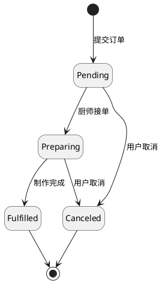
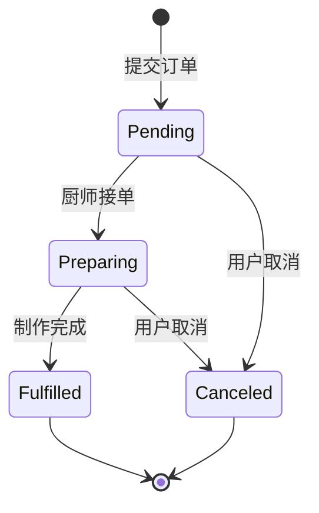

# Hex Diagram: State Transition

## Overview
本技能专门用于从业务需求中提取对象或系统的状态及其转换关系，并产出高质量的**状态流转图（State-Transition Diagram）**。基于《Software Requirements 3rd Edition》的理论指导，本技能确保状态流转的严谨性、完整性和无歧义性。

## Core Workflow

### Step 1: 收集上下文与需求 (Gather Context)
首先，通过提问或分析用户提供的需求，识别关键对象及其生命周期。
**关键问题：**
1. 我们正在分析的核心对象或系统是什么？（例如：订单、请假单、商品）
2. 该对象在整个生命周期中有哪些可能的**状态（States）**？
3. 触发状态发生改变的**事件（Events）**或**条件（Conditions）**是什么？
4. 是否存在特定的起点状态（Initial State）和终点状态（Termination States）？

### Step 2: 状态表分析 (State Table Analysis) - 理论验证
为了确保没有遗漏任何状态转换，在脑海中或草稿中构建一个**状态表（State Table）**：
- 行和列代表所有状态。
- 检查从每一个状态（左侧行）到另一个状态（顶部列）的转换是否合法，并识别出触发该转换的事件。
- **注意**：终点状态（如已取消、已完成）通常不能再转换到其他状态。

### Step 3: 选择输出格式并生成图表 (Generate Diagram)
根据用户的偏好，输出以下一种或多种格式：

#### Option A: PlantUML 代码
直接输出可在 PlantUML 渲染器中渲染的代码，使用 `[*] --> State` 表示开始，`--> [*]` 表示结束。

#### Option B: Mermaid 代码
输出 Mermaid 的 `stateDiagram-v2` 代码，适合在 Markdown 中直接预览。

#### Option C: Draw.io 提示词 (配合 MCP Server)
生成结构化的提示词，以便用户可以调用 `@next-ai-drawio/mcp-server` MCP 工具来自动生成并渲染 Drawio 图形。

## 理论基础 (Theory & Best Practices)
来源于《Software Requirements 3rd Edition》：
- **状态流转图 (STD) 和状态表 (State Table)** 提供了关于对象或系统状态的简洁、完整、无歧义的表示。
- **组成元素**：
  1. **状态 (States)**：对象在某一时间点所处的状况。
  2. **转换 (Transitions)**：从一个状态到另一个状态的合法路径。
  3. **条件/事件 (Conditions/Events)**：触发状态改变的具体业务事件。
- **验证完整性**：可以借用状态表的矩阵思维，逐一验证“状态A”能否流转到“状态B”，以防遗漏。

## 示例 (Examples)

### 场景：餐饮订单状态流转 (Meal Order Status)
**需求描述**：
订单刚创建时处于“待处理(Pending)”，厨师接单后变为“准备中(Preparing)”，完成后变为“已完成(Fulfilled)”。如果在处理前或处理中用户取消，则变为“已取消(Canceled)”。已完成或已取消是终止状态，不可再改变。

**输出 PlantUML 示例**:


**输出 Mermaid 示例**:


**输出 Draw.io MCP 提示词示例**:
```text
请使用 draw.io 生成一个状态流转图。包含以下节点和连接线：
- 节点：起点（圆点），Pending（矩形），Preparing（矩形），Fulfilled（矩形），Canceled（矩形），终点（同心圆）。
- 连线：
  - 起点 -> Pending，标签为“提交订单”
  - Pending -> Preparing，标签为“厨师接单”
  - Preparing -> Fulfilled，标签为“制作完成”
  - Pending -> Canceled，标签为“用户取消”
  - Preparing -> Canceled，标签为“用户取消”
  - Fulfilled -> 终点
  - Canceled -> 终点
请保持布局清晰，使用自上而下或从左到右的层级结构。
```

## 使用指南 (Usage Guidelines)
1. **输入明确**：如果用户的输入很模糊，请主动询问状态列表及其转移条件。
2. **审查异常流**：除了“快乐路径（Happy Path）”，必须询问是否存在回退、拒绝、取消等异常状态流转。
3. **保持内聚**：单一图表最好只描述**一个核心对象**的生命周期。如果是多个对象的复杂交互，考虑建议用户使用系统交互图或泳道图。